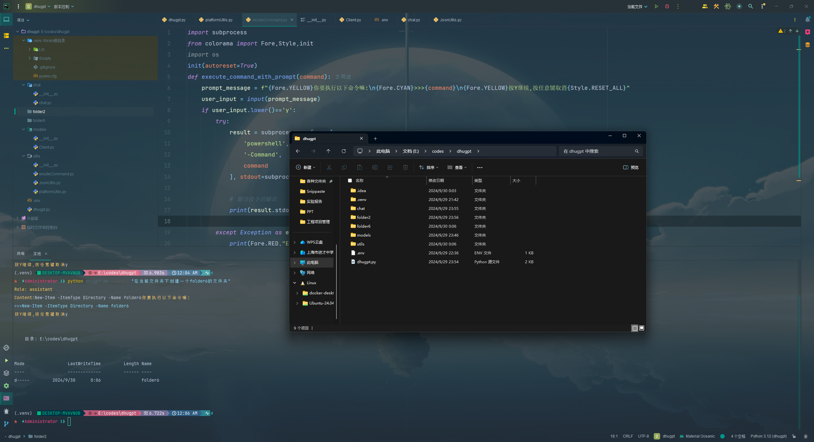
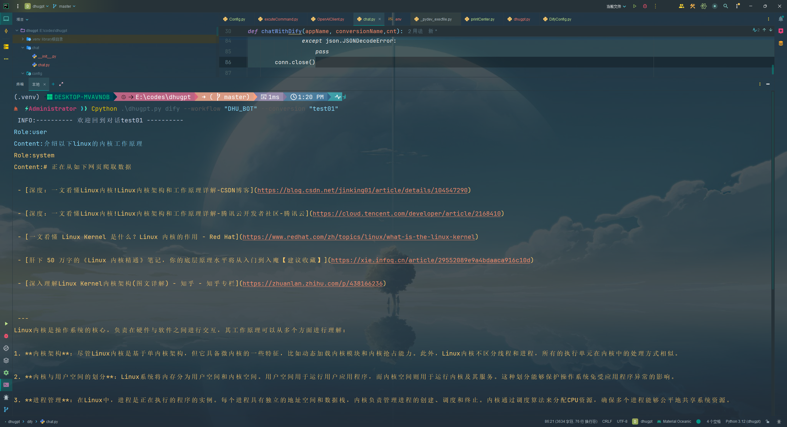
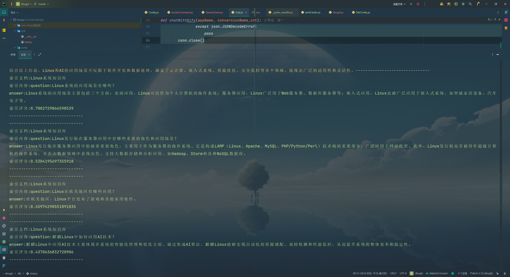
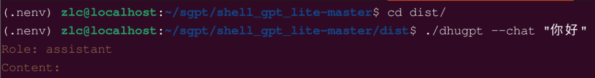
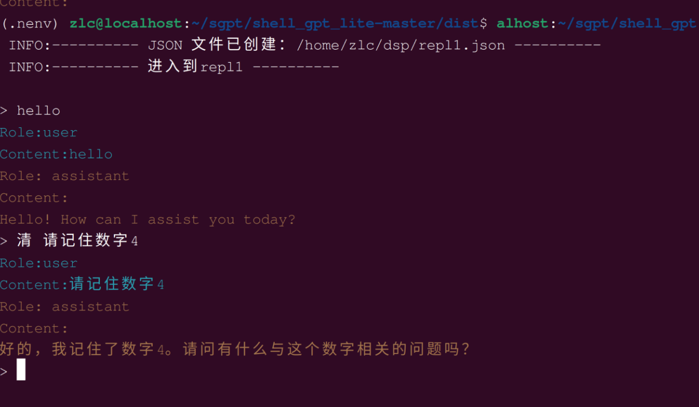
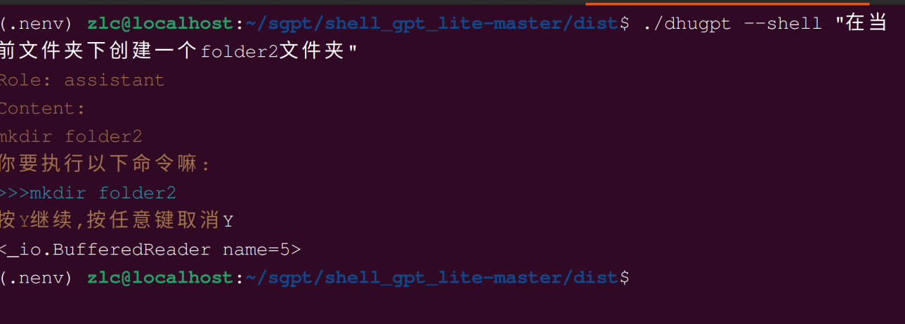
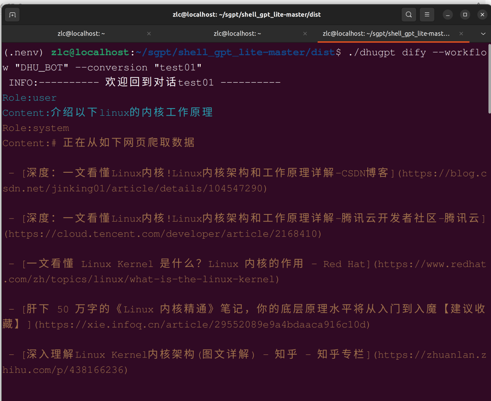

# 🌟 shell_gpt Lite

## 📖 项目介绍

> 这是一个简易版的 shell_gpt，参考 [shell_gpt](https://github.com/TheR1D/shell_gpt) 实现。当前实现了如下几个功能：
> - 💬 `--chat` 普通聊天，没有记忆
> - 📚 `--repl` 记忆聊天，会把之前的对话储存在 JSON 中
> - 🐚 `--shell` 可以生成针对不同平台的 shell 脚本，并提示执行
> - 🔄 `dify --workflow --conversion` 和配置文件中的 dify 进行交互

# 更新日志 😁

- 24/10/14 增加基于`chain of thought`的bash 代码生成功能,使用`-b` 或者 `--bash` 访问,使用`xml`
  语法解析每个步骤,但是就无法流失输出了,丧失交互性 \
  Prompt内容在[OpenAIClient.py](models%2FOpenAIClient.py)中
- 24/10/24 支持dify在回答末尾调用工具,现在是bash tools ,当然要求dify回复格式和[OpenAIClient.py](models%2FOpenAIClient.py)中的一样\
- dify的dsl文件分享在[difydsl](difydsl)中,供大家参考,同时还有一个sepersearch搜索的工作流,返回索引网站的链接和内容,便于在其他应用中展示
## ⚙️ 配置文件说明
首先复制环境变量示例文件：
```bash
cp .env.example .env
```

然后在 `.env` 文件中填入以下配置：

```bash
OPENAI_API_KEY: "OPENAI密钥"       # 🗝️ 你的 OpenAI 密钥
OPENAI_BASE_URL: "OPENAI代理地址"  # 🌐 OpenAI 代理地址
DEFAULT_PROMPT: "默认Prompt"         # 💡 默认 Prompt
DEFAULT_MODEL: "默认模型"            # 🎨 默认模型
DEFAULT_STORE_PATH: "存储repl的路径" # 📁 存储 repl 的路径
DIFY_CONFIG_PATH: "dify配置文件参考"  # ⚙️ dify 配置文件路径
```

对于 `DEFAULT_STORE_PATH`，你只需要填写一个本地路径即可，每一次新的 repl 会生成一个 JSON，如下所示：

```json
{
  "message": [
    {
      "role": "system",
      "content": "你是一个乐于助人的助手-dhu-shellGPT,专注于解决同学们在编程学习中遇到的各式各样的问题"
    },
    {
      "role": "user",
      "content": "请记住数字4"
    },
    {
      "role": "assistant",
      "content": "好的，我记住数字4了！有什么与这个数字有关的需要帮助的地方吗？"
    },
    {
      "role": "user",
      "content": "现在把这个数字加上4"
    },
    {
      "role": "assistant",
      "content": "数字4加上4等于8。如果你需要进一步的计算或者其他问题，请告诉我！"
    },
    {
      "role": "user",
      "content": "我第一次让你记住的数字是多少"
    },
    {
      "role": "assistant",
      "content": "你第一次让我记住的数字是4。如果还有其他问题或需要帮助的地方，请随时告诉我！"
    }
  ]
}
```

对于 `DIFY_CONFIG_PATH`，你需要填写一个 dify 的配置文件路径，如 `G:\\dify_config\\config.json`。这个 JSON 的格式如下：

```json
{
  "API_BASE_URL": "https://xxx/v1",
  "USER": "xxx",
  "APPS": {
    "APP_NAME": {
      "API_KEY": "应用的 api_key",
      "Conversions": {
        "聊天标题,": "conversion_id"
      }
    }
  }
}
```

其中 `Conversions` 一开始可以为空，当使用以下命令时：

```bash
python dhugpt.py dify --workflow APP_NAME --conversion ConversionName
```

如果 `ConversionName` 为空，系统会在该 app 的 conversions 对象中自动增加一条记录。

## 🖼️ 使用效果

### 记忆对话


### 执行命令



### dify 获得之前的历史记录



### dify 获得引用



## 📜 使用说明和开发

### 指令参考

- 短对话: `dhugpt --chat 'chat message'`
  

- 长对话: `dhugpt --repl 'replname'`
  

- 执行 shell 命令: `dhugpt --shell 'question'`
  

- 使用 dify 进行对话: `dhugpt dify --workflow {appname} --conversion {conversionname}`
  

### 🐧 在 Linux 上使用

```bash
source export_env.sh
```

运行 `export_env.sh`\
😨**记住是`source export_env.sh` 不是 `bash export_env.sh`**，这是因为`bash`导出的变量只对当前文件有效,而source是全局的\
输入必要的环境变量。有时候需要设置如下环境变量：

```bash
export all_proxy=''
export ALL_PROXY=''
```

### 📦 打包:

```bash
pip install -r 'requirements.txt'
pip install pyinstaller
pyinstaller --onefile dhugpt.py
```


